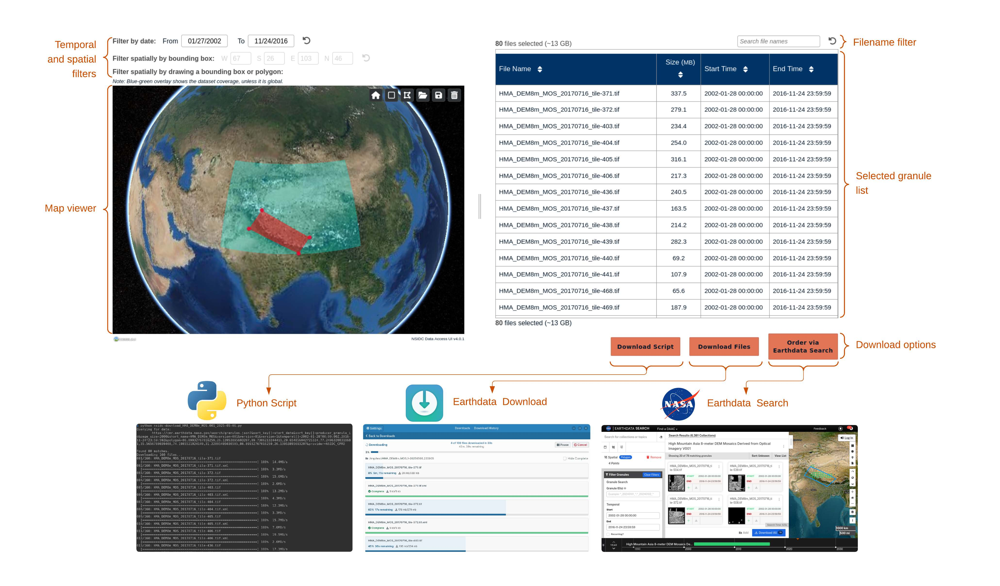

  

# Data Access Tool UI

Web interface to support granule-level discovery and access of NASA Earthdata for a
given data collection.

  

The DAT is composed of:

* [data-access-tool-backend](https://github.com/nsidc/data-access-tool-backend):
  backend servcies that support the Python bulk download script and
  Earthdata Download.
* [data-access-tool-vm](https://github.com/nsidc/data-access-tool-vm): NSIDC
  virtual machine configuration for deploying the backend service.

## Level of Support

This repository is fully supported by NSIDC. If you discover any problems or
bugs, please submit an Issue. If you would like to contribute to this
repository, you may fork the repository and submit a pull request.

See the [LICENSE](LICENSE) for details on permissions and warranties. Please
contact nsidc@nsidc.org for more information.

## Requirements

* [Node.js](https://nodejs.org/en) v14.19.0
* Access to NSIDC's internal Virtual Machine infrastructure to test deployments
  in Drupal (required for full loading of CSS assets).
* [Optional] development instance of the
  [data-access-tool-backend](https://github.com/nsidc/data-access-tool-backend/)
  for testing backend changes.

## Contributing

See [`./doc/DEVELOPMENT.md`](./doc/DEVELOPMENT.md).

## Credit

This content was developed by the National Snow and Ice Data Center with funding
from multiple sources.
